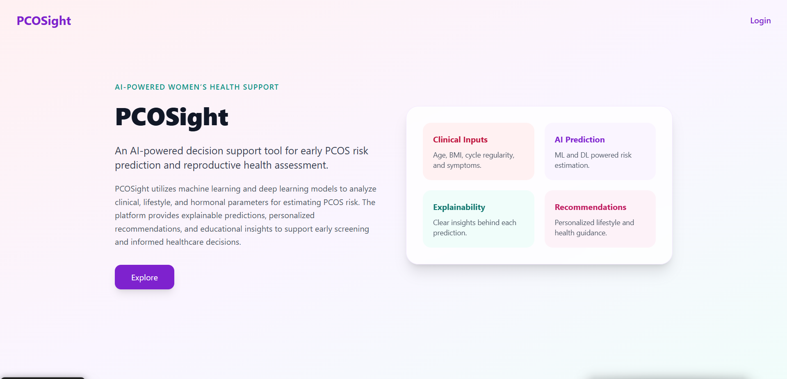
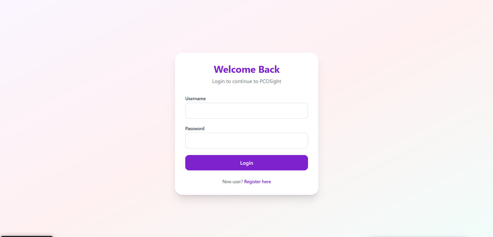
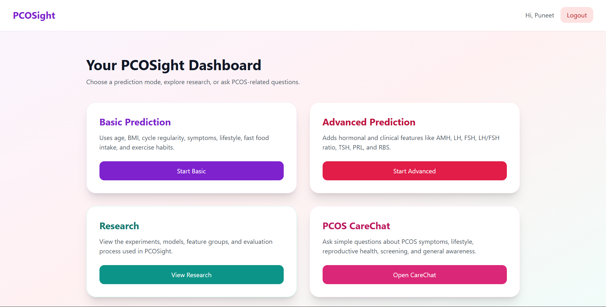
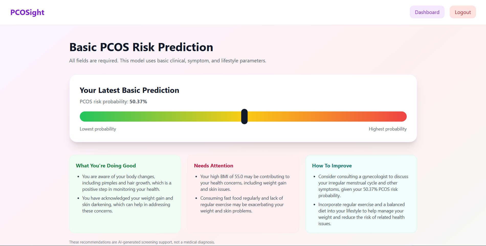
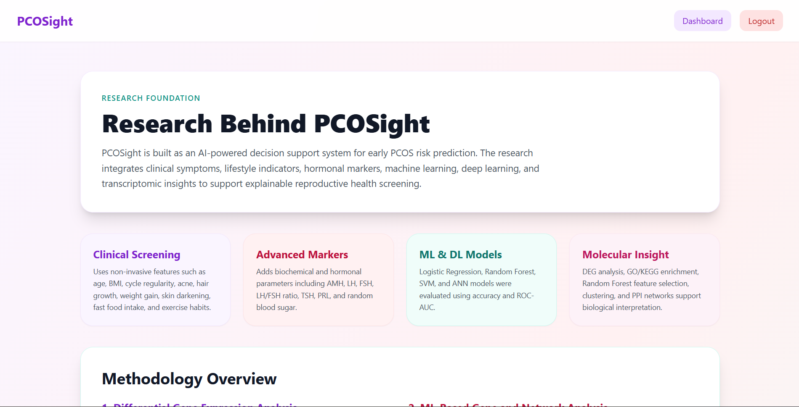
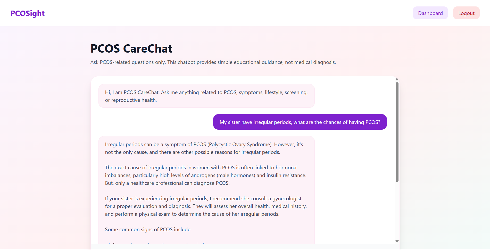

# README.md

# PCOSight

An AI-powered decision support tool for early PCOS risk prediction and reproductive health assessment.

PCOSight utilizes machine learning and deep learning models to analyze clinical, lifestyle, and hormonal parameters for estimating PCOS risk. The platform provides explainable predictions, personalized recommendations, and educational insights to support early screening and informed healthcare decisions.

---

## Features

- Basic PCOS risk prediction using clinical and lifestyle parameters
- Advanced prediction using hormonal and biochemical markers
- AI-generated personalized recommendations
- PCOS CareChat assistant powered by Groq LLMs
- Research and methodology exploration section
- User authentication system using Flask and SQLite
- Clean responsive UI using Tailwind CSS

---

## Tech Stack

### Frontend
- HTML
- Tailwind CSS
- JavaScript

### Backend
- Flask
- SQLite
- Groq API

### Machine Learning
- Logistic Regression
- Random Forest
- Support Vector Machine
- Artificial Neural Network (ANN)

---

## Environment Variables

Create a `.env` file in the root directory and add the following:

```env
SECRET_KEY=
GROQ_API_KEY=
GROQ_MODEL=llama-3.3-70b-versatile
CHATBOT_MODEL=llama-3.1-8b-instant
```

---

## Installation

```bash
git clone https://github.com/brpuneet898/PCOSight.git

cd PCOSight

pip install -r requirements.txt
```

---

## Run The Application

```bash
python app.py
```

Open browser:

```bash
http://127.0.0.1:5000
```

---

# Application Screenshots

## Explore Page



---

## Login Page



---

## Dashboard



---

## Basic Prediction



---

## Research Page



---

## PCOS CareChat



---

# Project Structure

```bash
PCOSight/
│
├── app.py
├── models.py
├── requirements.txt
├── .env
├── database.db
│
├── saved_models/
│   ├── basic_lr_model.pkl
│   ├── basic_lr_scaler.pkl
│   ├── basic_lr_features.pkl
│   ├── advanced_model.pkl
│   └── ...
│
├── templates/
│   ├── index.html
│   ├── login.html
│   ├── register.html
│   ├── dashboard.html
│   ├── basic.html
│   ├── advanced.html
│   ├── research.html
│   └── chatbot.html
│
├── static/
│   ├── css/
│   └── js/
│
└── images/
    ├── explore.png
    ├── login.png
    ├── dashboard.png
    ├── basic_prediction.png
    ├── research.png
    └── carechat.png
```

---

# AI Models Used

## Basic Prediction Model
Uses:
- Age
- BMI
- Cycle regularity
- Pimples
- Hair growth
- Hair loss
- Weight gain
- Skin darkening
- Fast food intake
- Exercise habits

## Advanced Prediction Model
Uses:
- AMH
- LH
- FSH
- LH/FSH ratio
- TSH
- PRL
- RBS
- Additional clinical parameters

---

# AI Recommendation Engine

After prediction, PCOSight generates:
- What you are doing good
- What needs attention
- How to improve

Recommendations are generated using:
- Groq Llama 3.3 70B Versatile

---

# PCOS CareChat

PCOS CareChat is a lightweight conversational assistant designed for:
- PCOS awareness
- Lifestyle guidance
- Symptom-related educational support
- Reproductive health information

Model Used:
- Llama 3.1 8B Instant

Note:
- Chats are not stored
- Session history is cleared automatically

---

# Research Foundation

PCOSight integrates:
- Clinical screening
- Lifestyle indicators
- Hormonal biomarkers
- Machine learning
- Deep learning
- Molecular interpretation techniques

---

# Contributors

## Kamnaa

Lead Researcher for PCOSight. Responsible for experimentation, feature analysis, model evaluation, and research workflow design.

## Puneet

Developer and Research Engineer behind PCOSight.

---

# Disclaimer

PCOSight is an educational and screening-support platform only. It is not a replacement for professional medical diagnosis, treatment, or clinical consultation.

Always consult a qualified healthcare professional for medical advice.

---

# License

This project is licensed under the MIT License.