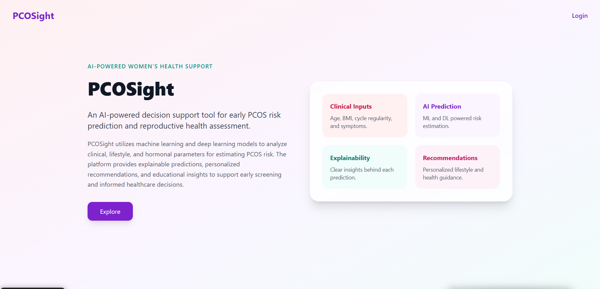
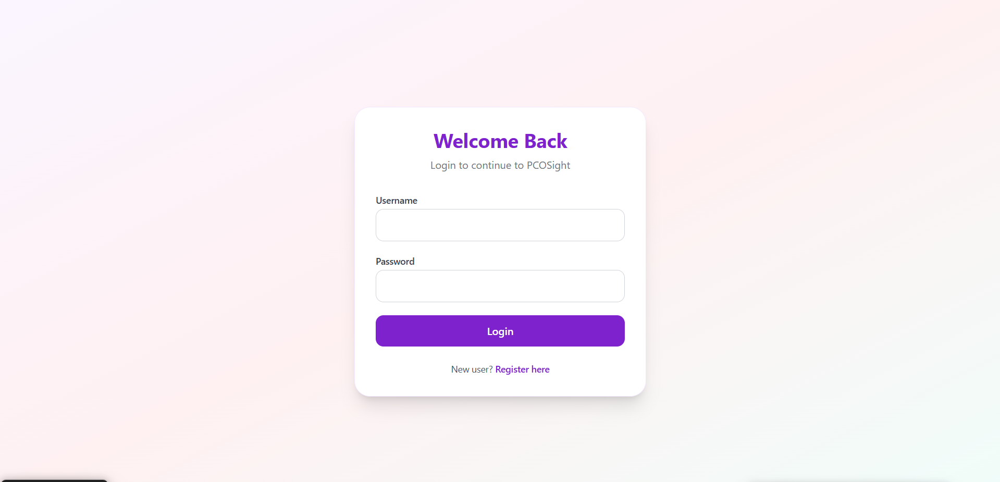
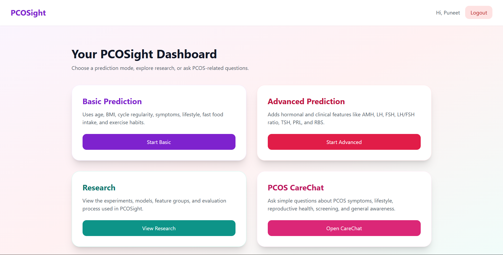
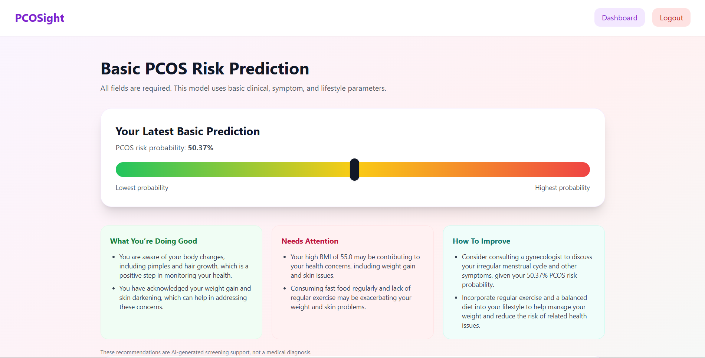
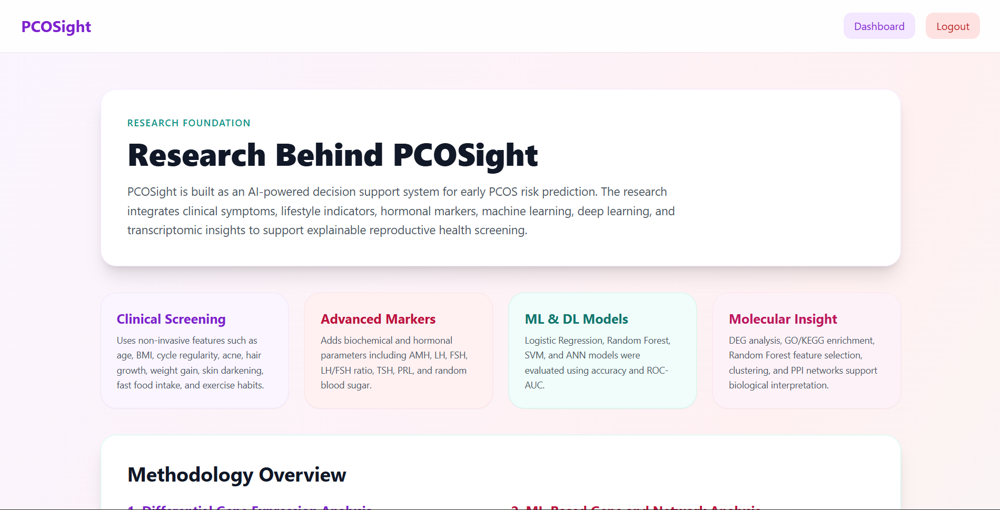
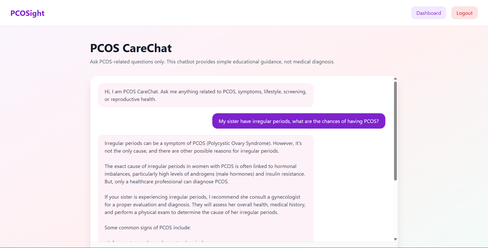

# PCOSight

PCOSight is research and educational decision-support software for PCOS risk screening. It estimates PCOS risk from clinical, lifestyle, hormonal, and biochemical inputs using saved machine learning models, then presents the result through a Flask web application.

The scientifically evaluated risk-estimation models are separate from the Groq-powered recommendation and CareChat features. Groq is used only as an auxiliary education and interpretation layer; it is not part of the validated PCOS risk-prediction algorithm.

## Key Features

- Basic PCOS risk screening using clinical and lifestyle indicators
- Advanced PCOS risk estimation using hormonal and biochemical markers
- Saved machine learning inference assets for reproducible prediction
- Groq-generated recommendation summaries as auxiliary educational support
- PCOS CareChat for general PCOS and reproductive-health education
- User registration, login, dashboard, and saved prediction results
- Research and methodology section connected to the underlying academic work
- Automated tests covering model loading, input validation, prediction, and routes

## Important Medical Notice

PCOSight is not a diagnostic medical device and does not diagnose PCOS or any other condition. It is research/educational software intended for risk screening, risk estimation, and decision-support only.

Prediction results should not be used as a substitute for professional medical advice, diagnosis, or treatment. Users should consult a qualified healthcare professional for clinical evaluation, interpretation of symptoms, laboratory findings, and treatment decisions.

## Research Provenance

PCOSight originates from academic research and experimentation performed for PCOS risk screening. The software connects the research workflow, trained model artifacts, and web-based inference interface into a reproducible software artifact.

The research notebooks and dataset resources are kept in the `Experiments/` directory. The production application uses serialized model assets from `saved_models/` for inference. Any Open Source Paper or software publication for PCOSight should be understood as a publication about the software artifact, its implementation, and its usability as research software, rather than a reproduction of thesis chapters.

## Technology Stack

**Frontend:** HTML, Tailwind CSS, JavaScript

**Backend:** Flask, Flask-SQLAlchemy, SQLite

**Machine Learning:** scikit-learn, pandas, joblib

**LLM Assistance:** Groq API for recommendations and CareChat education

## Project Structure

```text
PCOSight/
|-- app.py
|-- models.py
|-- requirements.txt
|-- README.md
|-- software_documentation.md
|-- saved_models/
|   |-- basic_lr_model.pkl
|   |-- basic_lr_scaler.pkl
|   |-- basic_lr_features.pkl
|   |-- basic_ann_model.h5
|   |-- basic_ann_scaler.pkl
|   |-- basic_ann_features.pkl
|   |-- advanced_rf_model.pkl
|   `-- advanced_rf_features.pkl
|-- templates/
|   |-- index.html
|   |-- register.html
|   |-- login.html
|   |-- dashboard.html
|   |-- basic.html
|   |-- advanced.html
|   |-- research.html
|   `-- chatbot.html
|-- tests/
|   |-- run_tests.py
|   |-- test_pcosight.py
|   `-- test_results.md
|-- Experiments/
|   |-- PCOS_Dataset.csv
|   |-- PCOS_Risk_Prediction.ipynb
|   `-- PCOS_Risk_Prediction_Inference.ipynb
|-- images/
`-- instance/
```

## Setup

Create and activate a Python environment, then install dependencies:

```bash
pip install -r requirements.txt
```

Create a `.env` file in the project root:

```env
SECRET_KEY=your-secret-key
GROQ_API_KEY=your-groq-api-key
GROQ_MODEL=llama-3.3-70b-versatile
CHATBOT_MODEL=llama-3.3-70b-versatile
```

`GROQ_API_KEY` is required for the recommendation and CareChat features. The saved machine learning prediction models are separate from Groq.

## Run The Application

```bash
python app.py
```

Open:

```text
http://127.0.0.1:5000
```

## Run Tests

From the project root:

```powershell
env\Scripts\python.exe tests\run_tests.py
```

The current automated test suite covers model loading, prediction output ranges, missing input fields, authentication redirects, form validation, and basic/advanced prediction route pipelines.

Latest recorded result:

```text
Tests run: 11
Failures:  0
Errors:    0
Result:    PASS
```

## Application Screenshots

### Explore Page



### Login Page



### Dashboard



### Basic Prediction



### Research Page



### PCOS CareChat



## Contributors

**Prof. Anjali Priyadarshani** - Conceptualization, reproductive-biology interpretation, scientific supervision, methodology, critical review and editing, and project supervision.

**Kamnaa** - Lead researcher for PCOSight, responsible for experimentation, feature analysis, model evaluation, and research workflow design.

**Puneet** - Developer and research engineer responsible for software implementation, Flask application development, model integration, and documentation.

## License

This project is licensed under the MIT License.
